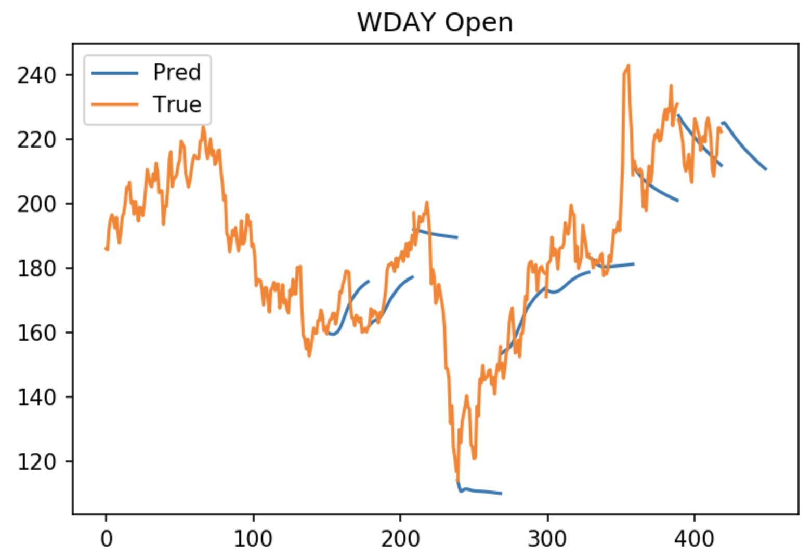
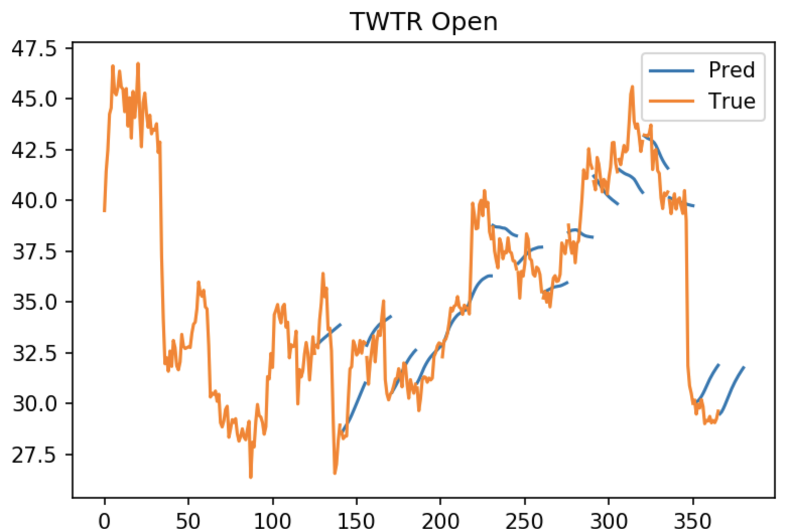

# Stock-Price-Prediction
Predict stock price with LSTM/Transformer. Extract the time-series infomation from previous "Open, Close, Low, High, Volume" of a stock and predict the following days.


An example, 
```PYTHON
from tiker_wrapper import Tiker

wday = Tiker('WDAY', bs=202, usedays=120, smoothing=None)  # how many past days to use, smoothing means ewm smoothing
wday.auto(retrain=False, lr=5e-4, scheduler='cycle', optimizer='adam', verbose=True, 
          dims=[[65], 515, [515]], transformer=False,
          dim_feedforward=2045, num_layers=1, nhead=5, startsave=5,
          cycle_momentum=False, wd=0.01, mode='triangular', dropout=0, min_lr=5e-6, add_bn=False,
          step_size_up=20, base_lr=5e-5, max_lr=1e-4, factor=0.5, patience=10, epochs=300)
```

I implemented different learning rate scheduler, inckuding `cycle, warm-up, reduce`, it worth a try. You can flexibly adjust the embedding layers before or after 
LSTM/Transformer. You can predict the prices after as many days as you want, but usually, it is helpful to see the prices after 15 or 30 days to see the trend.




# Dependencies
1. Pytorch >= 1.4
2. Numpy
3. Matplotlib
4. Scipy
5. yfinance (https://pypi.org/project/yfinance/)
